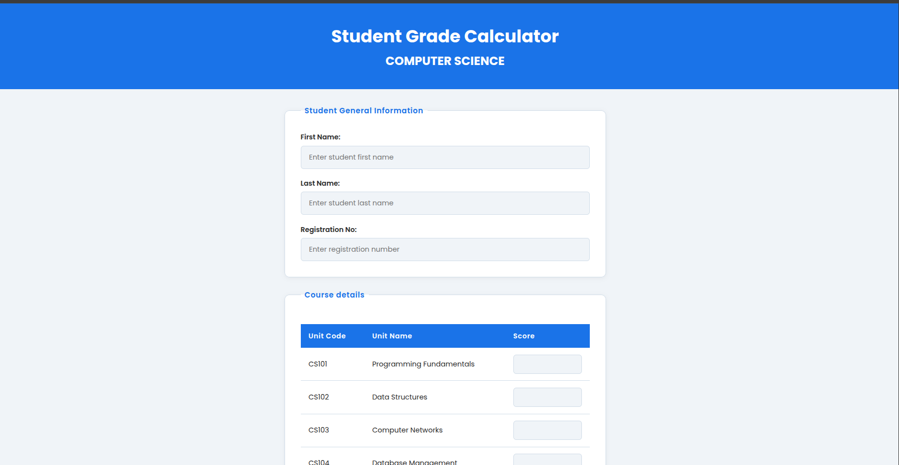

# Student Grade Calculator

A student grade calculator built with HTML, CSS, JavaScript and PHP.

## Live Demo

[View Live Site](https://vee-mukoma.ifree.page/grade-calculator/index.php)

### Page screenshot



## Description

A web application that calculates student grades based on scores entered for five Computer Science units. The application reads the submitted form data using PHP, calculates the total, average and grade, then displays the results on a separate page with a clear pass or fail status.

## Features

- Enter student first name, last name and registration number
- Enter scores for 5 Computer Science units
- Calculates total score, average score and grade automatically
- Displays pass or fail status with a colored badge
- JavaScript validation to ensure scores are whole numbers
- Redirects to form if results page is accessed directly

## Technologies Used

- HTML5
- CSS3
- JavaScript
- PHP

## How to Run Locally

1. Clone the repository

```bash
   git clone https://github.com/vee-mukoma/grade-calculator.git
```

2. Move the project folder to your server's web root

```bash
   sudo mv grade-calculator /var/www/html/
```

3. Open your browser and visit

http://localhost/grade-calculator/index.php

> Note: This project requires a local PHP server such as Apache to run. It cannot be opened directly in a browser like a static HTML file.

## What I Learned

- How to handle multi-page PHP applications
- How to use $_POST to read and process form data
- How to perform calculations in PHP
- How to dynamically apply CSS classes using PHP
- How to validate form inputs using JavaScript

## Author

Built by Vanessa Mukoma
